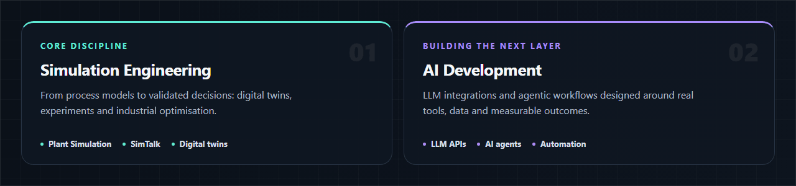
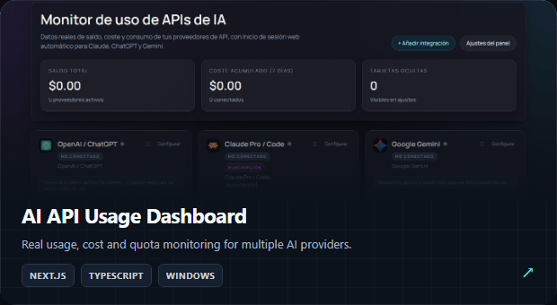
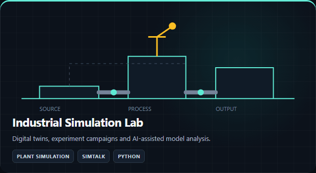
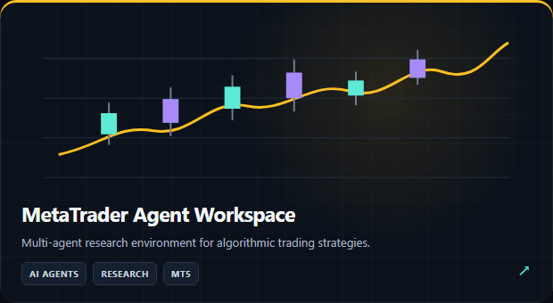

 

&nbsp;

## About

I am a **Simulation & Automation Engineer** working at the intersection of industrial engineering and software development. My core field is **Siemens Plant Simulation**: digital twins, discrete-event models, experiment campaigns and process optimisation.

Alongside simulation, I build practical AI systems — **LLM integrations, AI agents, multi-agent workflows and intelligent automation** — using Python and modern software engineering practices.

Currently working at **Sothis**, within the PLM department.

## Selected projects

### Highlights

- **BuenCholloTech** — a production platform and Master's Final Project that combines FastAPI, React, Amazon integrations and AI-assisted content generation.
- **AI API Usage Dashboard** — a Next.js dashboard and Windows tray application for monitoring real usage, costs and quotas across AI providers.
- **Industrial Simulation Lab** — private engineering work with Plant Simulation, SimTalk, repeatable campaigns and AI-assisted analysis.
- **MetaTrader Agent Workspace** — a multi-agent environment for researching algorithmic trading strategies.

## Technology stack

## What I am exploring

- AI agents that can work with simulation models, evidence and engineering documentation.
- Reliable bridges between industrial data, digital twins and decision-support systems.
- Production-grade AI applications with explicit verification and human oversight.

---

**Plant Simulation · Digital Twins · AI Engineering · Industrial Automation**

Building useful intelligence for real systems.

