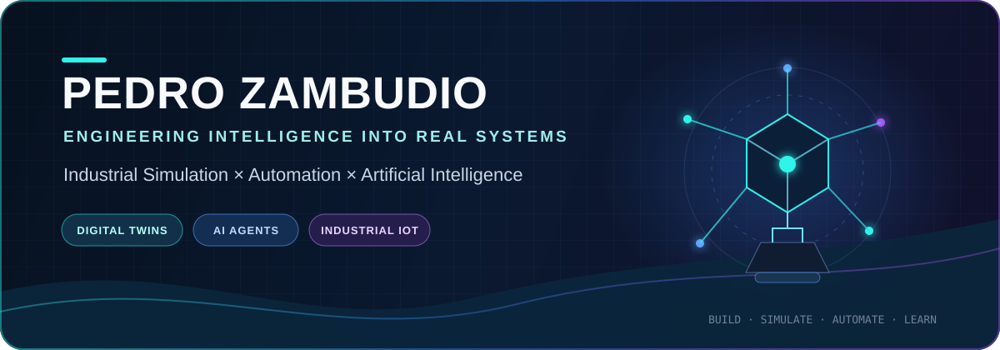
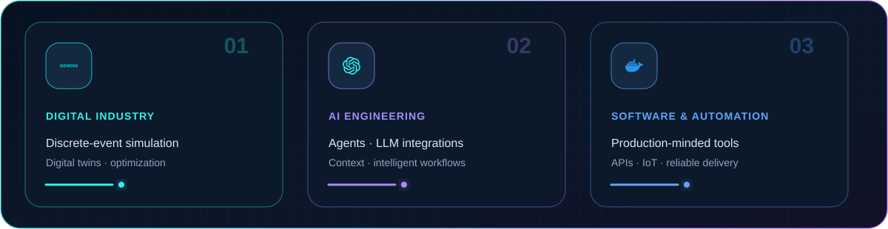
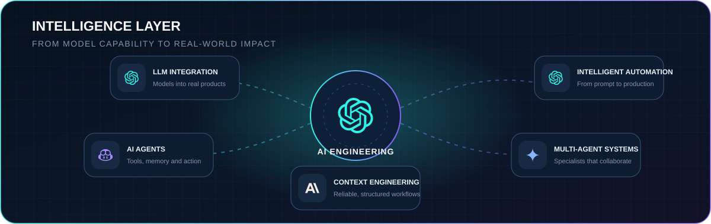
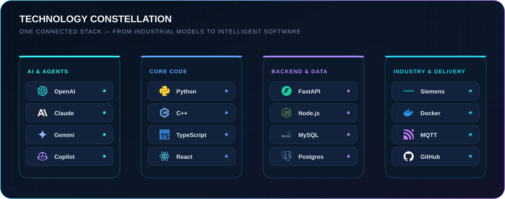
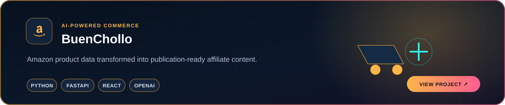
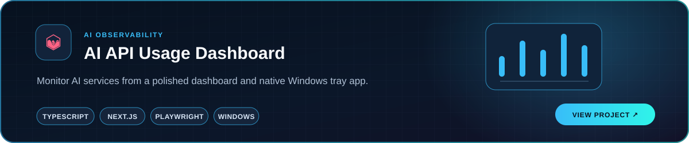
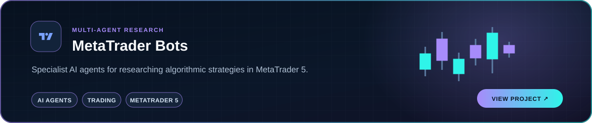
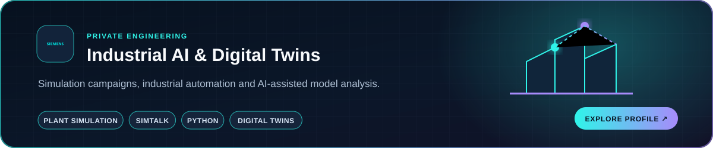

 

## Hello, I'm Pedro

I'm a **Simulation & Automation Engineer** who turns complex industrial processes into systems that can be understood, tested and improved. My work sits where **digital twins, industrial software, data and artificial intelligence** meet.

Currently working at **Sothis** in the PLM department, building solutions around process simulation, CAD/PLM integrations and industrial digitalization.

> **My goal:** connect the physical and digital worlds — then make them smarter with AI.

## What I build

## AI capabilities

- Designing **agentic workflows** that connect models, tools, APIs and domain knowledge.
- Integrating **OpenAI-compatible APIs** into real applications and automation pipelines.
- Building model-provider abstractions, structured prompts and context-aware systems.
- Applying AI to industrial engineering, product content, analytics and trading research.
- Using AI-assisted development with an emphasis on architecture, verification and documentation.

## Technology radar

## Selected work

Every public project card opens its repository.

## Beyond the code

- 🎯 I care about solutions that are **measurable, maintainable and useful in the real world**.
- 📚 I document decisions so that people — and AI agents — can continue the work confidently.
- 🌍 **Spanish** native · **English** professional.
- 🔭 Exploring the next layer of industrial intelligence: simulation models that can reason, explain and improve.

---

### From the factory floor to intelligent software.

*Simulate everything. Automate the rest. Make it intelligent.*

Open to conversations about industrial simulation, automation, digital twins and applied AI.

